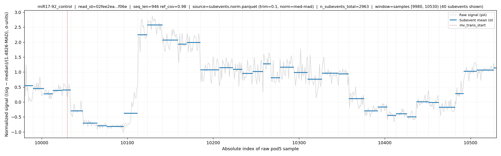
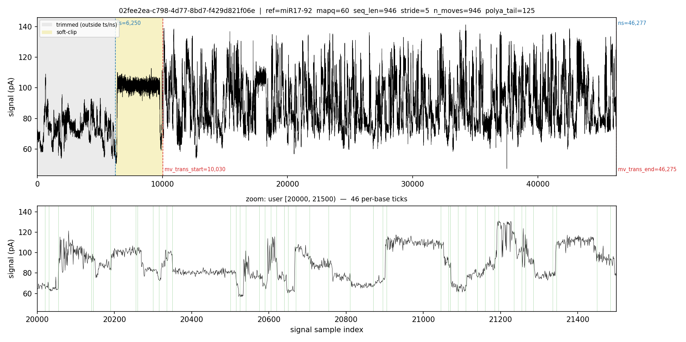
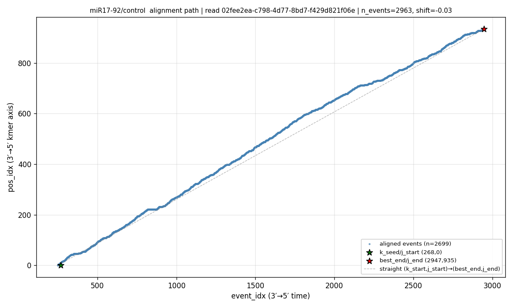

# segSHAPE diagnostic plots (`segshape plot`)

`segshape plot` is the diagnostic-figure entry point. It does not feed the
pipeline — every sub-command reads an output of an earlier step and renders a
PNG so you can *eyeball* that the step did the right thing: did segmentation
place peaks sensibly, did the move table land where the alignment says, did the
event→k-mer DP path look monotone.

There are **three** sub-sub-commands:

| command | what it shows | reads |
|---|---|---|
| `plot segment` | subevent means (and optional ±std band) overlaid on the raw pod5 signal | `pod5/` + `pod5.index` + `dorado.extract_mv.csv` + `subevents*.parquet` |
| `plot dorado-mv` | one read's full signal with the trimmed / soft-clip / polyA regions shaded and per-base move ticks | `pod5/` + `pod5.index` + `dorado.extract_mv.csv` + `dorado.sorted.bam` |
| `plot alignment-path` | the per-read event→k-mer DP path with entry/exit anchors and the slope-1 reference | a sweep cell's `alignment.csv` + `scale.csv` |

Each comes with a ready-to-run example off the shipped fixture (below).
Matplotlib (and pysam / pod5) are imported lazily inside each `run`, so
`segshape plot --help` stays instant. Run `segshape plot <kind> --help` for the
full flag list of any sub-command.

---

## The example data — `tests/data/plot_example/`

You do not need a full multi-GB run to try these plots. The repo ships a tiny
fixture — **three reads carved out of the `miR17-92` `control` sample**
(RNA002) — laid out in the standard `datasets/<DATASET>/<SAMPLE>/` tree so the
same `--root-dir / --dataset / --sample` resolution the pipeline uses works
unchanged. The whole thing is ~500 KB:

```
tests/data/plot_example/
├── read_ids.txt                       # the 3 picked read_ids
└── datasets/miR17-92/control/
    ├── 1_raw_signal/
    │   ├── pod5/plot_example.pod5      # only the 3 reads' signal
    │   └── pod5.index
    ├── 2_base_called/dorado-0.9.6/
    │   ├── dorado.sorted.bam           # the 3 reads' records (carry the mv tag)
    │   └── dorado.sorted.bam.bai
    └── 3_alignment/
        ├── dorado.extract_mv.csv       # header/comments + 3 rows
        ├── subevents.norm.parquet      # the 3 reads' subevents (norm=med-mad)
        └── rna002_norm_de50_dk15_bc0.0_sp50_lwnone_sm1.0_k50.0/
            ├── alignment.csv           # the 3 reads' DP path rows
            ├── scale.csv               # the 3 reads' per-read calibration
            └── pos_kmer_table.csv
```

The three reads (all `qc_tag == PASS`, all from one source pod5 file):

```
02fee2ea-c798-4d77-8bd7-f429d821f06e
032a695e-179a-4038-9218-188fef8a22dd
03a1a850-a4ef-4f9f-912b-1f86fe56f692
```

### Rebuilding / re-carving the fixture

[`tests/make_plot_example.py`](../tests/make_plot_example.py) is the reproducible
builder. It subsets the pod5 (`pod5 filter`), rebuilds the index
(`segshape pod5index`), subsets the BAM (`samtools view -N`), and filters the
CSV / Parquet rows down to the chosen reads (keeping the original `read_idx`, so
`alignment.csv` ↔ `scale.csv` stay consistent). It auto-picks reads from the
intersection described below; point it at any completed run with
`PLOT_EXAMPLE_SRC` (and a matching `PLOT_EXAMPLE_CELL`):

```bash
# defaults to the miR17-92 control run + its production sweep cell
PLOT_EXAMPLE_SRC=/path/to/datasets/<DATASET>/<SAMPLE> \
PLOT_EXAMPLE_CELL=<sweep_cell_name> \
    python tests/make_plot_example.py
```

It needs the `pod5` and `samtools` CLIs and a `segshape` install on `PATH`.

> **Why these inputs?** A read shows up in a plot only if it survived every step
> feeding that plot: it must be in the pod5 index, a primary mapped record in the
> BAM, a row in `dorado.extract_mv.csv`, present in `subevents*.parquet`, and
> `PASS` in the sweep cell's `scale.csv`. The builder picks reads from the
> intersection, so all three plots work on the same three reads.

In the examples below, run from the package root and set:

```bash
ROOT=tests/data/plot_example
CELL=rna002_norm_de50_dk15_bc0.0_sp50_lwnone_sm1.0_k50.0
RID=02fee2ea-c798-4d77-8bd7-f429d821f06e
```

---

## `plot segment` — subevents on raw signal

Overlays the segmentation output (`subevents.parquet`) on the raw pod5 trace: a
faint signal line, vertical subevent boundaries, and a thick horizontal segment
at each subevent's `mean_pa`. This is the QC plot for **step 4** — use it to
check peak placement and level fitting.

```bash
segshape plot segment \
    --root-dir $ROOT --dataset miR17-92 --sample control \
    --subevents-file subevents.norm.parquet --read-id $RID \
    --out-dir figures/segment
```

- The fixture ships the **normalized** segments (`subevents.norm.parquet`), so
  pass `--subevents-file subevents.norm.parquet`; the plot auto-detects the
  `norm=med-mad` schema tag and draws the signal in σ-units to match. (The
  default basename is the legacy raw-pA `subevents.parquet`.)
- Drop `--read-id` to let it pick a random eligible read; drop `--dataset` /
  `--sample` to **batch-render** every `(dataset, sample)` under
  `<root>/datasets/`.
- Window selection: by default it zooms to `[mv_trans_start - 50, +500)`;
  `--zoom-anchor {start,mid,end}` moves the window along the aligned region, or
  give absolute `--zoom-start S --zoom-end E`. `--plot-std` adds a translucent
  ±std band behind each mean segment.

Output: `figures/segment/miR17-92_control_<rid8>_<lo>_<hi>_norm.png`.



*Read `02fee2ea…` of the example fixture: the gray trace is the median/MAD-normalized
signal (σ-units), each blue segment is a subevent's `mean_pa`, and the dashed red
line is `mv_trans_start`. RNA002's stepped plateaus make the level fitting easy to
eyeball.*

## `plot dorado-mv` — move table over the signal

Plots one read's whole signal with the basecaller regions shaded — trimmed
(`[0,ts)` / `[ns,end)`), polyA + soft-clip (`[ts,mv_trans_start)` /
`[mv_trans_end,ns)`), and the aligned slice in between — plus per-base move
"1" ticks in a zoomed bottom panel. Use it to confirm the move table and the
`mv_trans_start/end` interval line up with where the signal actually changes.

```bash
segshape plot dorado-mv \
    --root-dir $ROOT --dataset miR17-92 --sample control \
    --read-id $RID --zoom-mode user --plot-start 20000 --plot-end 21500 \
    --out figures/dorado_mv.png
```

- `--read-id` is required. The BAM is auto-resolved via
  `2_base_called/dorado-*/dorado.sorted.bam` (the move table is read from its
  `mv` tag), or pass explicit `--csv` / `--bam` / `--pod5-dir`.
- Bottom-panel zoom: `--zoom-mode aligned` (the full aligned slice), `user`
  (an explicit `--plot-start` / `--plot-end` window, used above), or `random`
  (a `--random-window`-sample slice at `--seed`). `--max-ticks` thins the
  per-base ticks for long windows.



*Top: the full signal with the trimmed (gray) and polyA + soft-clip (khaki)
regions shaded between the `ts/ns` and `mv_trans_start/end` boundaries. (The
red polyA-primary band only appears for RNA004's `pa:B:i` tag, absent here.)
Bottom: the requested 1500-sample zoom window `[20000, 21500)` with one green
tick per basecalled move.*

## `plot alignment-path` — the event→k-mer DP path

Scatters the per-read alignment from **step 5** (event index on x, k-mer
position on y), marks the `k_seed/j_start` entry and `best_end/j_end` exit
anchors, and draws the straight slope-1 reference the DP would follow with no
skips or stays. A healthy path hugs the diagonal.

```bash
segshape plot alignment-path \
    --align-dir $ROOT/datasets/miR17-92/control/3_alignment/$CELL \
    --out figures/alignment_path.png
```

- `--align-dir` points at a **sweep cell** directory (the one holding
  `alignment.csv` + `scale.csv`).
- Without `--read-id` it auto-picks the `PASS` read with the highest k-mer-axis
  coverage; reads with `qc_tag != PASS` are rejected. `--title-prefix` prepends
  a label (e.g. the dataset/sample) to the figure title.



*The blue DP path climbs monotonically from the green `k_seed/j_start` entry
anchor to the red `best_end/j_end` exit anchor, tracking the dashed slope-1
reference — what a clean, skip-light alignment looks like.*
